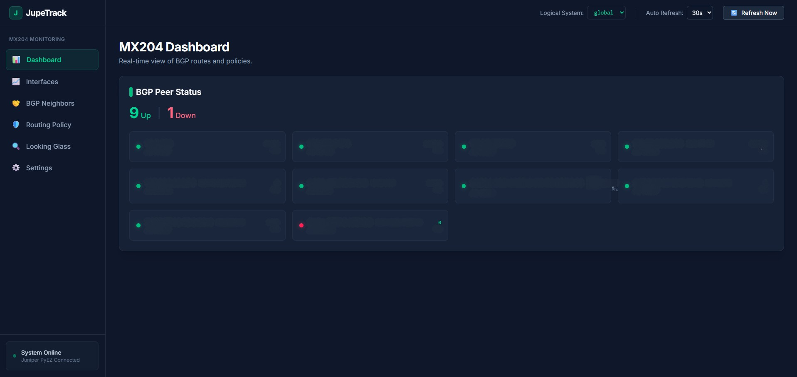
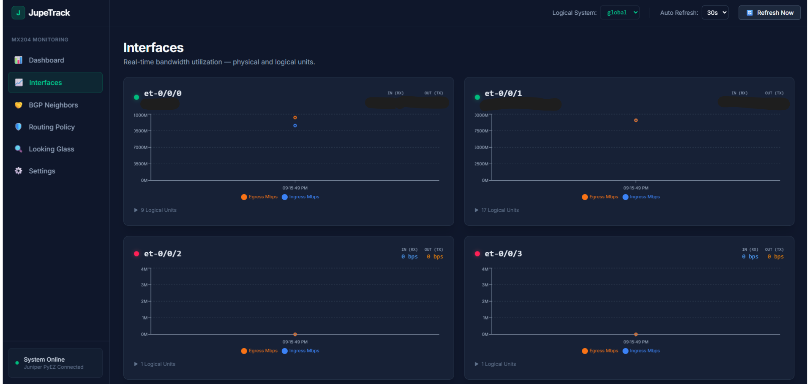
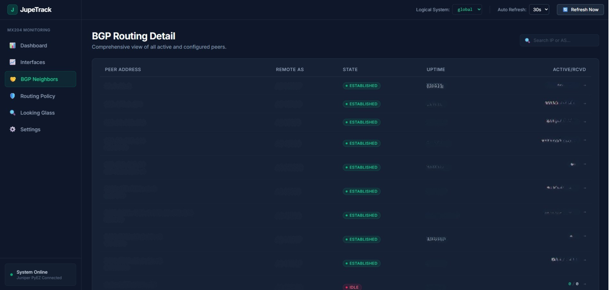
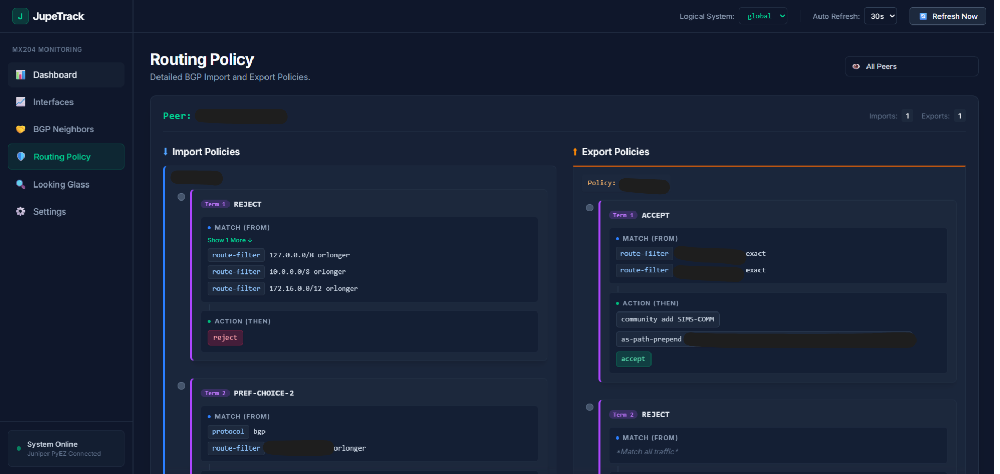
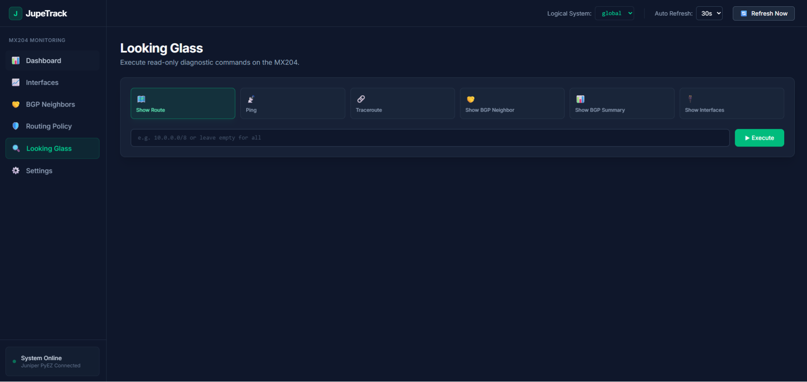

# JupeTrack - Juniper MX204 Monitoring Dashboard

<div align="center">

[](https://nextjs.org/)
[](https://react.dev/)
[](https://tailwindcss.com/)
[](https://recharts.org/)
[](https://www.python.org/)
[](https://fastapi.tiangolo.com/)
[](https://github.com/Juniper/py-junos-eznc)
[](https://www.docker.com/)
[](https://docs.docker.com/compose/)

</div>

**JupeTrack** is a modern, real-time web dashboard designed specifically for monitoring Juniper MX204 routers. Built with a FastAPI backend leveraging Junos PyEZ (NETCONF) and a responsive Next.js frontend, it provides deep visibility into your BGP routing, interface bandwidth, and system diagnostics.

<div align="center">
  
  
  
  
  
</div>

## Features

- 🌐 **BGP Dashboard**: Real-time view of BGP peers, states, ASNs, uptimes, and active/received prefixes.
- 📈 **Interface Traffic Graphs**: Live Ingress (Rx) and Egress (Tx) bandwidth utilization graphs (Mbps) for physical links using Recharts.
- 🛡️ **Routing Policy Viewer**: Visualizes configured BGP Import and Export policies (`policy-options`), mapping routing terms and actions per peer.
- 🔍 **Looking Glass**: Secure, read-only diagnostic terminal supporting `ping`, `traceroute`, `show route`, `show bgp summary`, and `show interfaces`.
- ⚙️ **Dynamic Device Configuration**: Update the target MX204 IP, username, password, and port directly from the UI without restarting the container.
- 🏢 **Multi-Logical System Support**: Seamlessly switch between different `logical-systems` (or `global`). The selected context is automatically preserved across all tabs.

## Tech Stack

## Quick Start (Docker)

The entire application runs inside a single, optimized Docker container.

### 1. Clone the repository

```bash
git clone https://github.com/arcelo12/jupe-track.git
cd jupe-track
```

### 2. Configure Environment

A default `.env` is created automatically, but you should verify the backend database configuration in `backend/.env` if needed.

### 3. Build & Run

```bash
docker compose up -d --build
```

### 4. Access the Dashboard

Open your browser and navigate to:
**http://localhost:3040**

_(If running on a remote server, replace `localhost` with the server's IP address)._

## Initial Setup

1. Open the **Settings** tab (⚙️) on the bottom left of the sidebar.
2. Enter your Juniper MX204 management IP, NETCONF port (typically `830`), username, and password.
3. Click "Save Configuration".
4. Navigate to the Dashboard or BGP screen. The system will automatically fetch available Logical Systems and populate the routing data.

## Configuration Requirements (Junos)

Ensure your Juniper MX204 has NETCONF over SSH enabled:

```junos
set system services netconf ssh
```

> **Note**: The API account must have Operational (`view`) and Configuration (`view-configuration`) access, but no write permissions.

For strict enterprise environments, here is the exact `login class` required for this dashboard to function properly:

```junos
set system login class api-readonly-class permissions view
set system login class api-readonly-class permissions view-configuration
set system login class api-readonly-class allow-commands "(show bgp .*)|(show configuration .*)|(show route .*)|(show interfaces .*)|(ping .*)|(traceroute .*)"
set system login class api-readonly-class deny-commands "(request .*)|(clear .*)|(start .*)"

set system login user jupe-api class api-readonly-class
```

## Development

If you wish to run the backend and frontend separately for development:

**Backend (FastAPI):**

```bash
cd backend
python -m venv venv
source venv/bin/activate
pip install -r requirements.txt
uvicorn main:app --host 0.0.0.0 --port 3041 --reload
```

**Frontend (Next.js):**

```bash
cd frontend
npm install
npm run dev
```

## License

MIT License.
