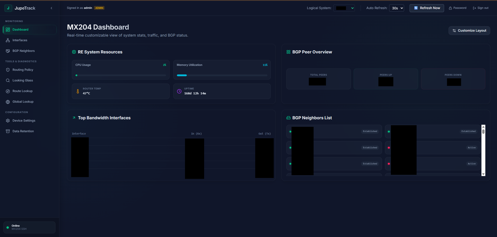

# JupeTrack - Enterprise Juniper MX204 Monitoring Dashboard

<div align="center">

[](https://nextjs.org/)
[](https://react.dev/)
[](https://tailwindcss.com/)
[](https://recharts.org/)
[](https://www.python.org/)
[](https://fastapi.tiangolo.com/)
[](https://www.sqlalchemy.org/)
[](https://www.sqlite.org/)
[](https://www.mysql.com/)
[](https://jwt.io/)
[]()
[](https://github.com/Juniper/py-junos-eznc)
[](https://www.docker.com/)

</div>

**JupeTrack v2.0** is an enterprise-grade web dashboard designed specifically for monitoring Juniper MX204 routers. Built with a robust FastAPI backend leveraging Junos PyEZ (NETCONF), a persistent relational database (SQLite/MySQL), and a responsive glassmorphism Next.js frontend, it provides deep real-time and historical visibility into your BGP routing, interface bandwidth, and system diagnostics.

<div align="center">
  
  <!-- You can add more screenshot links here -->
</div>

## ✨ Key Features (v2.0 Enterprise Upgrades)

- 🔐 **Secure Authentication**: JWT-based login system (Access & Refresh tokens) with bcrypt password hashing. Includes a protected Admin panel and user profile management.
- 🗄️ **Persistent Storage**: Built-in support for **SQLite** (zero-config default) and **MySQL** for high-volume deployments. Safely stores long-term historical traffic and BGP data.
- ⏱️ **Background Scraper (APScheduler)**: Continuous, fully autonomous background data collection. The backend tirelessly scrapes interface traffic and BGP metrics every 60 seconds (configurable), even when no browser is open.
- 📊 **Historical Data Visualization**: Switch between **Live** monitoring and beautiful **Historical** Recharts graphs (up to 7 days or more). Interact with sparklines on hover and deep-dive into modal area charts for every logical interface unit.
- ⚙️ **Data Retention Policies**: Administrators can dynamically adjust scraper intervals (10s to 10m) and set auto-cleanup retention thresholds (1 to 365 days) directly from the UI without restarting containers.

## 🌐 Core Functionality

- **BGP Dashboard**: Real-time view of BGP peers, states, ASNs, uptimes, and active/received prefixes.
- **Interface Traffic Graphs**: Live Ingress (Rx) and Egress (Tx) bandwidth utilization graphs (Mbps) for physical links and logical sub-interfaces using Recharts.
- **Routing Policy Viewer**: Visualizes configured BGP Import and Export policies (`policy-options`), mapping routing terms and actions per peer.
- **Looking Glass**: Secure, read-only diagnostic terminal supporting `ping`, `traceroute`, `show route`, `show bgp summary`, and `show interfaces`.
- **Multi-Logical System Support**: Seamlessly switch between different `logical-systems` (or `global`). The selected context is automatically preserved across all tabs.

---

## 🚀 Quick Start (Docker)

The entire application runs inside a single, optimized Docker container.

### 1. Clone the repository

```bash
git clone https://github.com/arcelo12/jupe-track.git
cd jupe-track
```

### 2. Configure Environment

Copy the provided example environment file and update the variables:

```bash
cd backend
cp .env.example .env
nano .env
```

Key variables to update:
- `SECRET_KEY`: Must be a long, random secure string.
- `ADMIN_USERNAME` / `ADMIN_PASSWORD`: Custom credentials for the first admin account.
- `DB_TYPE`: Leave as `sqlite` for zero-configuration, or change to `mysql` for a dedicated Database container.
- `JUNOS_*`: (Optional) Provide default credentials for your MX204. You can also edit this via the dashboard UI later.

### 3. Build & Run

**For default SQLite storage:**
```bash
docker compose up -d --build
```

**For MySQL storage:** 
Ensure `DB_TYPE=mysql` is set in your `.env` and start with the mysql profile:
```bash
docker compose --profile mysql up -d --build
```

### 4. Access the Dashboard

Open your browser and navigate to:
**http://localhost:3040**

Log in using the default credentials (`admin` / `Admin@JupeTrack2024`). You can change your password immediately from the top-right header menu.

---

## 🛠️ Initial Setup Post-Login

1. Open the **Settings** tab (⚙️) on the bottom left of the sidebar.
2. Enter your Juniper MX204 management IP, NETCONF port (typically `830`), username, and password.
3. Click "Save Configuration".
4. Navigate to **Data Retention (🗄️)** to customize your background scraping intervals and storage policies.
5. The system will automatically begin collecting data in the background.

## 🔒 Configuration Requirements (Junos)

Ensure your Juniper MX204 has NETCONF over SSH enabled:

```junos
set system services netconf ssh
```

> **Note**: The API account must have Operational (`view`) and Configuration (`view-configuration`) access, but no write permissions.

For strict enterprise environments, here is the exact `login class` required for this dashboard to function properly:

```junos
set system login class api-readonly-class permissions view
set system login class api-readonly-class permissions view-configuration
set system login class api-readonly-class allow-commands "(show bgp .*)|(show configuration .*)|(show route .*)|(show interfaces .*)|(ping .*)|(traceroute .*)"
set system login class api-readonly-class deny-commands "(request .*)|(clear .*)|(start .*)"

set system login user jupe-api class api-readonly-class
```

## 💻 Development Setup

If you wish to run the backend and frontend separately for development:

**Backend (FastAPI):**

```bash
cd backend
python -m venv venv
source venv/bin/activate
pip install -r requirements.txt
uvicorn main:app --host 0.0.0.0 --port 3041 --reload
```

**Frontend (Next.js):**

```bash
cd frontend
npm install
npm run dev
```

## 📄 License

MIT License.
