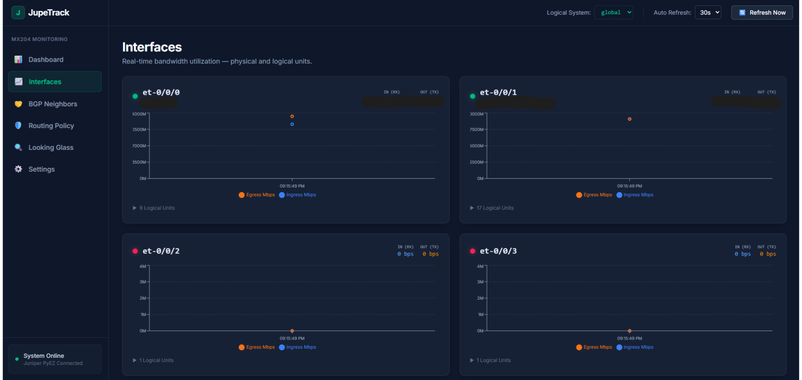
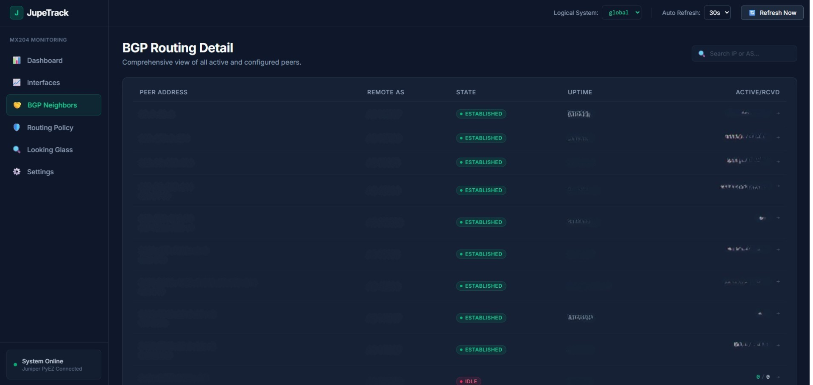
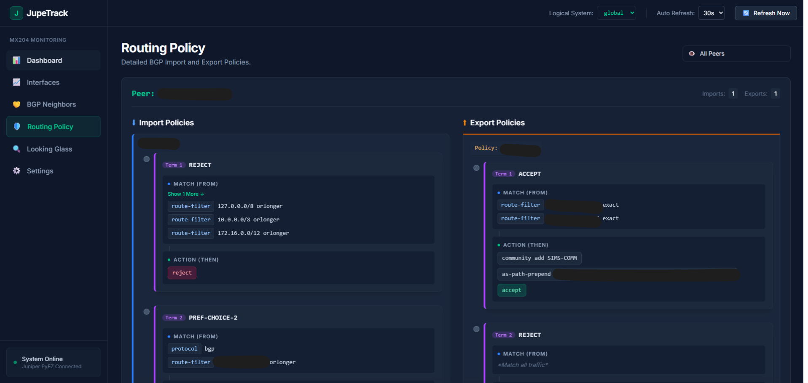
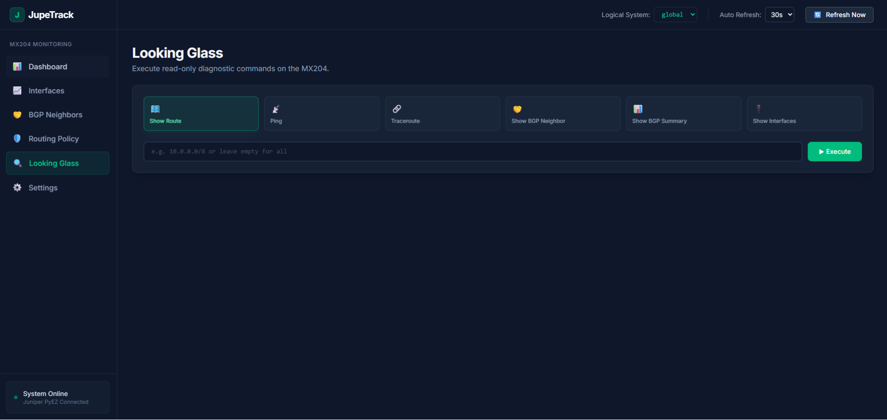

<div align="center">

# JupeTrack - Enterprise Juniper MX204 Monitoring

[](https://go.dev/)
[](https://nextjs.org/)
[](https://victoriametrics.com/)
[](https://www.docker.com/)
[](./LICENSE)

**An intelligent, high-performance monitoring dashboard tailored specifically for Juniper Networks MX204 Edge Routers.**


</div>

<br />

## 📖 Table of Contents
- [What is JupeTrack?](#-what-is-jupetrack)
- [Architecture & Tech Stack](#-architecture--tech-stack)
- [Core Features](#-core-features)
- [Getting Started (Docker)](#-getting-started-docker)
- [Environment Configuration](#-environment-configuration)
- [Juniper Device Configuration](#-juniper-device-configuration)
- [Local Development Setup](#-local-development-setup)
- [External API & Integrations](#-external-api--integrations)
- [Screenshots](#-screenshots)

---

## 🎯 What is JupeTrack?

Network administrators managing Juniper MX204 routers often struggle with fragmented visibility. Traditional NMS (Network Management Systems) can be overly complex, hard to set up, or lack granular BGP tracking and visual looking glass functionality out of the box.

**JupeTrack** bridges this gap by providing an "install-and-go" solution. It communicates directly with the MX204 via **NETCONF**, automatically extracting, indexing, and visualizing critical routing and traffic data. It allows operators to pinpoint bandwidth bottlenecks, review routing policies, and track BGP session drops within a beautiful, modern interface.

---

## 🏗️ Architecture & Tech Stack

JupeTrack v2.0 has been entirely re-architected for enterprise scale:

1. **Frontend (Next.js 16 & React 19):** A highly responsive, glassmorphism-inspired UI featuring `Recharts` for interactive graphing and `TailwindCSS 4` for styling.
2. **Backend Engine (Go 1.22+):** A lightning-fast API backend that maintains a continuous, autonomous background scraper. It queries the MX204 securely via NETCONF (over SSH).
3. **Time-Series Storage (VictoriaMetrics):** All historical bandwidth (Rx/Tx) and statistical data is efficiently stored in VictoriaMetrics, ensuring lightning-fast metric retrieval.
4. **Relational Storage (SQLite/MySQL):** Handles user authentication, device configurations, and system preferences.

---

## ✨ Core Features

### 📡 1. BGP Peering & Analytics
- **Live BGP Status:** Monitor ASNs, session states (Established, Idle, Active), uptimes, and prefix counts (received/active).
- **Routing Policy Visualizer:** Decode BGP `policy-options`. Map out import and export terms logically per peer directly from the web interface.

### 📊 2. High-Fidelity Traffic Graphs
- **Physical & Logical Interfaces:** Track bandwidth utilization (Mbps) across all physical links and logical sub-interfaces (`units`).
- **Time-Travel Data:** Switch seamlessly between **Live Mode** and **Historical Mode** to investigate traffic spikes over the last hour, day, or week.
- **Sparklines & Area Charts:** Interactive hoverable charts for intuitive trend spotting.

### 🛠️ 3. Integrated Looking Glass
- A read-only diagnostic terminal built directly into the web UI.
- Securely execute operations like `ping`, `traceroute`, `show route`, `show bgp summary`, and `show interfaces` without providing engineers full SSH terminal access.

### 🔐 4. Enterprise Security & Multi-Tenancy
- **JWT Authentication:** Secure login using access & refresh tokens.
- **Multi-Logical System Support:** Seamlessly switch between different `logical-systems` (or `global` routing table).
- **Admin Panel:** Manage users, scraper intervals, and data retention policies.

---

## 🚀 Getting Started (Docker)

The fastest and most reliable way to run JupeTrack is via Docker Compose. Everything runs in isolated, orchestrated containers.

### Prerequisites
- Docker Engine & Docker Compose (`docker compose`)
- A Juniper MX204 router accessible via network (Port 830 / 22 for NETCONF)

### Installation Steps

**1. Clone the repository:**
```bash
git clone https://github.com/arcelo12/jupe-track.git
cd jupe-track
```

**2. Setup Configuration:**
```bash
cd backend-go
cp .env.example .env
nano .env  # Edit your environment variables (see below)
```

**3. Launch the Stack:**
```bash
cd ..
docker compose up -d --build
```

**4. Access the Dashboard:**
Open your browser and navigate to **`http://localhost:3040`**.
Log in using your defined `ADMIN_USERNAME` and `ADMIN_PASSWORD`. Once logged in, navigate to **Settings** to add your Juniper MX204 credentials.

---

## ⚙️ Environment Configuration

Inside `backend-go/.env`, configure the following critical parameters:

| Variable | Description | Default / Example |
|---|---|---|
| `SECRET_KEY` | 64-character random string for JWT encryption. **Must change in production!** | `random-secret-key...` |
| `ADMIN_USERNAME` | The initial administrator username. | `admin` |
| `ADMIN_PASSWORD` | The initial administrator password. | `SecurePass123!` |
| `DB_TYPE` | Choose relational database (`sqlite` or `mysql`). | `sqlite` |
| `JUNOS_HOST` | (Optional) IP Address of your Juniper MX204. | `192.168.1.1` |
| `JUNOS_PORT` | (Optional) NETCONF Port. | `830` |

---

## 🔒 Juniper Device Configuration

JupeTrack uses **NETCONF over SSH** to collect metrics securely. Ensure your MX204 is configured properly:

### 1. Enable NETCONF
```junos
set system services netconf ssh
```

### 2. Create a Read-Only API User (Security Best Practice)
The API account only needs Operational (`view`) and Configuration (`view-configuration`) access. **No write permissions are required.**

Run the following commands on your MX204 to create the strictest possible role:

```junos
# 1. Define the read-only class and strictly allow only necessary diagnostic commands
set system login class api-readonly-class permissions view
set system login class api-readonly-class permissions view-configuration
set system login class api-readonly-class allow-commands "(show bgp .*)|(show configuration .*)|(show route .*)|(show interfaces .*)|(ping .*)|(traceroute .*)"

# 2. Explicitly deny dangerous commands
set system login class api-readonly-class deny-commands "(request .*)|(clear .*)|(start .*)"

# 3. Create the user and assign the class
set system login user jupe-api class api-readonly-class authentication plain-text-password
```

---

## 💻 Local Development Setup

Want to contribute or modify JupeTrack? You can run the Go backend and Next.js frontend independently.

### Backend (Go API & Scraper)
```bash
cd backend-go
# Ensure VictoriaMetrics is running locally via Docker or bare-metal
go mod download
go run cmd/main.go
```
*API will run on `http://localhost:8080`*

### Frontend (Next.js 16)
```bash
cd frontend
# Copy env configuration
cp .env.example .env.local
npm install
npm run dev
```
*Frontend will run on `http://localhost:3000`*

---

## 🔌 External API & Integrations

JupeTrack exposes a REST API (`/api/v1`) for integrating with other services
(Grafana, Zabbix, custom tooling, etc.). Authentication supports JWT (user
login) and **API keys** (`X-API-Key` header) with fine-grained scopes.

**Quick start — create an API key via CLI (no login needed):**

```bash
docker exec jupetrack_go /app/apikey create --name grafana --scopes 'read:*'
docker exec jupetrack_go /app/apikey list
docker exec jupetrack_go /app/apikey update --id 1 --scopes 'read:*,exec:looking-glass'
```

**Use it:**

```bash
curl -s http://localhost:8085/api/v1/live/bgp \
  -H "X-API-Key: jpt_<your-key>"
```

**Documentation:**

- 📘 [docs/API.md](docs/API.md) — full API reference (Bahasa Indonesia): auth,
  scopes, rate limits, every endpoint with curl examples, WebSocket, admin routes.
- 📄 [docs/openapi.yaml](docs/openapi.yaml) — OpenAPI 3.0 spec (import into
  Swagger UI / Postman / Insomnia).
- 💡 [docs/examples/](docs/examples/) — ready-to-run client examples in
  [Python](docs/examples/python_client.py) and [Go](docs/examples/go_client.go).

| Scope | Access |
|---|---|
| `read:bgp` | BGP summary, policies, logs, live peers, AS mappings |
| `read:interfaces` | Interface traffic stats (live) |
| `read:metrics` | Scraper status, TSDB history, interface/peer lists |
| `read:device` | Device CPU/memory/uptime status |
| `read:lookup` | External RIPEstat ASN/IP/community lookups |
| `read:*` | Wildcard — all read scopes above |
| `exec:looking-glass` | Looking glass (ping, traceroute, show route, BGP) on the router |

---

## 📸 Screenshots

*(Images are located in the `docs/` directory. Add or preview them to see the interface).*

<div align="center">
  
  
  
  
</div>

---

## 🤝 Contributing

Contributions are heavily encouraged! Please follow standard fork-and-pull-request workflows.
1. Fork the Project
2. Create your Feature Branch (`git checkout -b feature/AmazingFeature`)
3. Commit your Changes (`git commit -m 'Add some AmazingFeature'`)
4. Push to the Branch (`git push origin feature/AmazingFeature`)
5. Open a Pull Request

## 📄 License

This project is open-sourced software licensed under the [MIT license](LICENSE).
